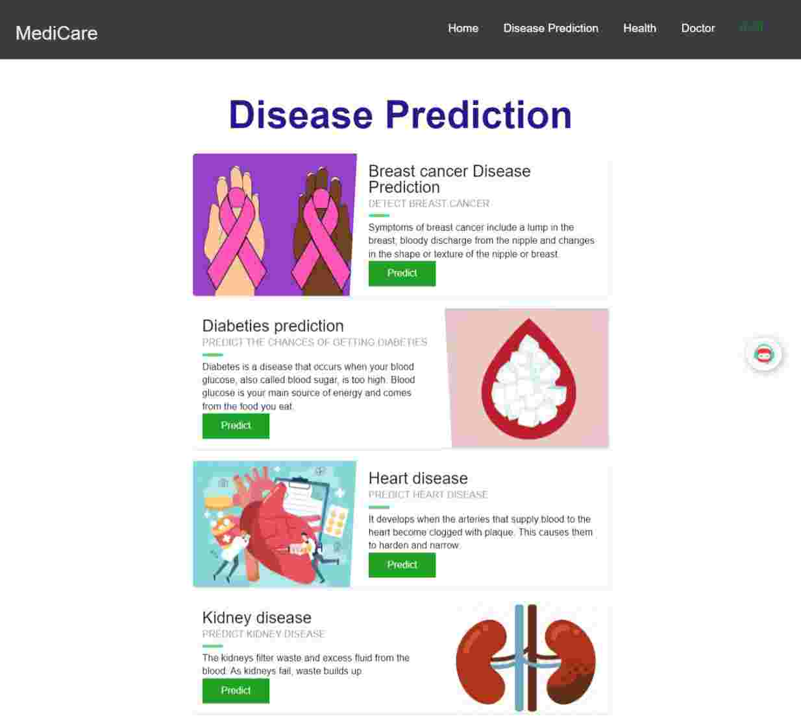
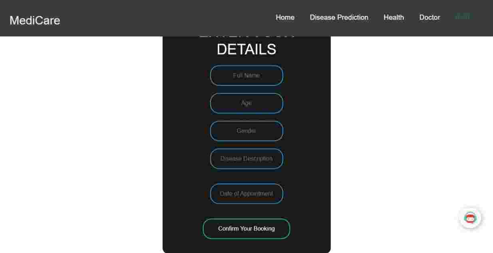

# MediCare

 <a href="https://github.com/mohit200008/medi-Care/pulls" target="_blank"></a> <a href="https://github.com/mohit200008/medi-Care/issues" target="_blank"></a> <a href="https://github.com/mohit200008/medi-Care/blob/master/README.md#contributors-" target="_blank"></a>

With the rise of people getting affected with Covid-19, we were looking into the data on the level of healthcare people all around India was receiving, one of the things we found that people in rural areas are clueless about the symptoms of the disease. They also lack proper medical supervision/care.

Hence, we came up with the idea of providing the people all over the world a web application that will not only connect the those in need with the correct medical care/supervision but also enable them to understand the implications of different diseases in a very intuitive way.

## Table of Contents

- [⚕️ MediCare ⚕️](#medicare)
  - [👩‍⚕️ What it does 👩‍⚕️](#what-it-does)
  - [💡 Demo 💡](#demo)
  - [💪🏻 How we built it 💪🏻](#how-we-built-it)
  - [🎖️ Accomplishments that we're proud of 🎖️](#accomplishments-that-were-proud-of)
  - [🎖️ Screenshots 🎖️](#screenshots)
    - [Home page](#home-page)
    - [Disease Prediction](#disease-prediction)
    - [Smart BMI Calculator](#smart-bmi-calculator)
    - [Search for doctor](#search-for-doctor)
    - [Doctor booking](#doctor-booking)
    - [Smart Chatbot](#smart-chatbot)
- [🏥 Dataset used 🏥](#dataset-used)
- [Remote backend URL](#remote-backend-url)
  - [🤔 Prerequisites 🤔](#prerequisites)
  - [💣 Installing and Running 💣](#installing-and-running)
- [🧑‍💻 How to Contribute 🧑‍💻](#how-to-contribute)
  - [⭐  HOW TO MAKE A PULL REQUEST :](#how-to-make-a-pull-request)
    - [Alternatively, Git CLI way to Sync forked repository with origin repository](#alternatively-git-cli-way-to-sync-forked-repository-with-origin-repository)
    - [Github Docs for Syncing](#github-docs-for-syncing)
  - [Contributors](#contributors)
    - [The Wonderful People Who Contributed Here](#the-wonderful-people-who-contributed-here)
  - [All the best 🥇](#all-the-best)
    - [Keep smiling 😄](#keep-smiling)
    - [Happy coding 🥳](#happy-coding)
## What it does

MediCare is a one stop location to discuss about different medical milestones, AI Disease prediction system, locate nearby hospitals to get proper medical care, and finally a translator to get the whole web app in the language one is comfortable with and hence dissolve any communication barrier. This solution with shorten the gap between the people around the world in search for good healthcare and pave a path in the journey of recovery.

## Demo

➡️ The live demo can be checkout from [here](https://medi-care-phi.vercel.app/)

➡️ The demo video of the project can be used [here](https://www.youtube.com/watch?v=C-avaGP2-M8&ab_channel=MohitLamba)

## How we built it

- For frontend we have used React Js.
- For Disease prediction we have used django.
- For styling we have used CSS and Bootstrap.

## Accomplishments that we're proud of

- Available in multiple languages
- Smart AI Disease Detection
- Easy to use Calorie Calculator
- Exercise tracking
- Search for Doctors near you
- Consume less time and work effectively
- Custom Scroll bar

## Screenshots

### Home page


### Disease Prediction



### Smart BMI Calculator




### Search for doctor


### Doctor booking


### Smart Chatbot


# Dataset used

1) [Diabetes](https://www.kaggle.com/uciml/pima-indians-diabetes-database): Pima Indian Diabetes Dataset

2) [Heart](https://www.kaggle.com/ronitf/heart-disease-uci): Heart Disease Dataset

3) [Kidney](https://www.kaggle.com/mansoordaku/ckdisease): Chronic Kidney Disease Dataset

4) [Breast Cancer](https://www.kaggle.com/uciml/breast-cancer-wisconsin-data): Winconsin Breast Cancer Dataset

# Remote backend URL

(<https://medicare-backend.herokuapp.com/>)

## Prerequisites

Required to install and run the software:

- [npm](https://www.npmjs.com/get-npm)

## Installing and Running

From the project folder, run these commands in console (terminal) to install dependencies and run the app:

```
npm install
```

```
npm run start
```

# How to Contribute

[](https://github.com/mohit200008/medi-Care/pulls)
[](https://github.com/ellerbrock/open-source-badges/)

- Take a look at the existing [Issues](https://github.com/mohit200008/medi-Care/issues) or [create a new issue](https://github.com/mohit200008/medi-Care/issues/new/choose)!
- [Fork the Repo](https://github.com/mohit200008/medi-Care/fork), create a branch for any issue that you are working on and commit your work.
- Create a **[Pull Request](https://github.com/mohit200008/medi-Care/compare)** (_PR_), which will be promptly reviewed and given suggestions for improvements by the community.
- Add screenshots or screen captures to your Pull Request to help us understand the effects of the changes that are included in your commits.

## HOW TO MAKE A PULL REQUEST

**1.** Start by making a fork the [**medi-Care**](https://github.com/mohit200008/medi-Care) repository. Click on the <a href="https://github.com/mohit200008/FoodSaver20008/fork"></a> symbol at the top right corner.

**2.** Clone your new fork of the repository:

```bash
git clone https://github.com/<your-github-username>/medi-Care
```

**3.** Set upstream command:

```bash
git remote add upstream https://github.com/mohit200008/medi-Care.git
```

**4.** Check the remotes for this repository.

```
git remote -v
```

**5.** Navigate to the new project directory:

```bash
cd medi-Care
```

**6.** Create a new branch:

```bash
git checkout -b <YourBranchName>
```

**7.** Sync your fork or local repository with the origin repository:

- In your forked repository click on "Fetch upstream"
- Click "Fetch and merge".

### Alternatively, Git CLI way to Sync forked repository with origin repository

```bash
git fetch upstream
```

```bash
git merge upstream/main
```

### [Github Docs](https://docs.github.com/en/github/collaborating-with-pull-requests/addressing-merge-conflicts/resolving-a-merge-conflict-on-github) for Syncing

**8.** Make your changes to the source code.

**9.** Stage your changes and commit:

```bash
git add .
```

```bash
git commit -m "<your_commit_message>"
```

**10.** Push your local commits to the remote repository:

```bash
git push origin <YourBranchName>
```

**11.** Create a [Pull Request](https://help.github.com/en/github/collaborating-with-issues-and-pull-requests/creating-a-pull-request)!

**12.** **Congratulations!** You've made your first contribution! 🙌🏼

## Contributors

### The Wonderful People Who Contributed Here

<table>
 <tr>
  <td>
   <a href="https://github.com/mohit200008/medi-Care/graphs/contributors">
      
   </a>
  </td>
 </tr>
</table>

## All the best

<p align="center">

[](https://github.com/unnati914/Care4ther-)

</p>

### Keep smiling

### Happy coding
